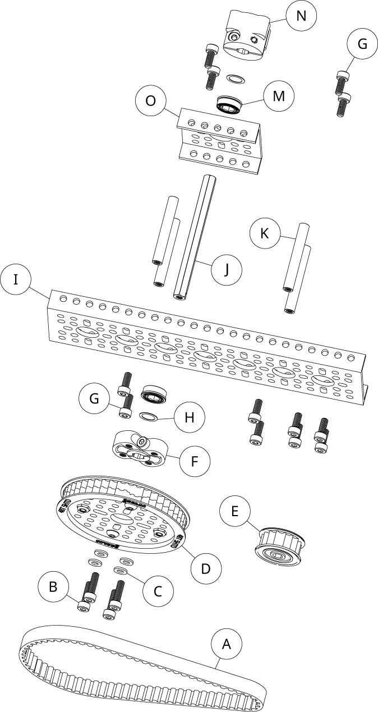
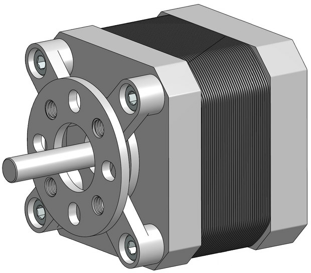
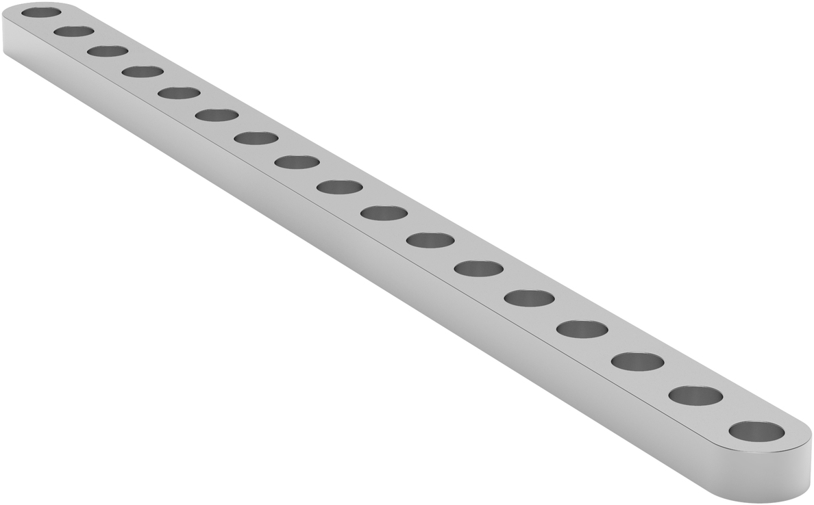
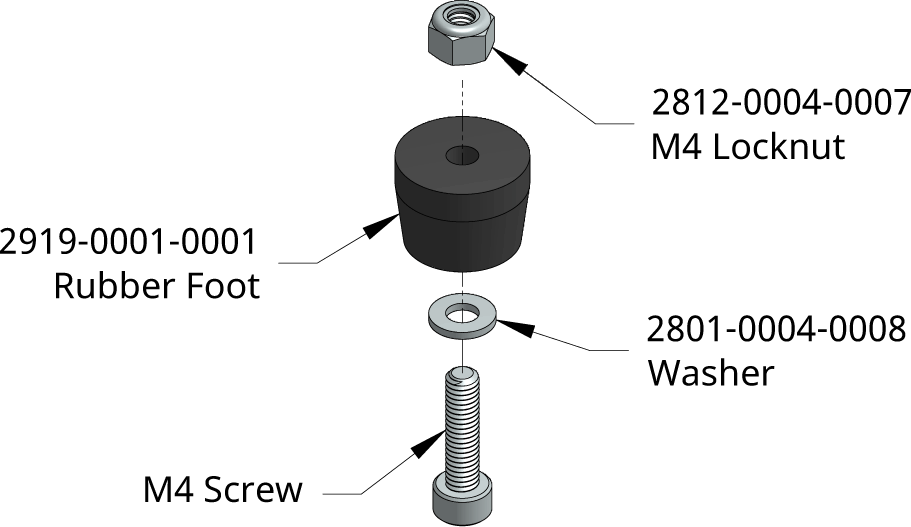
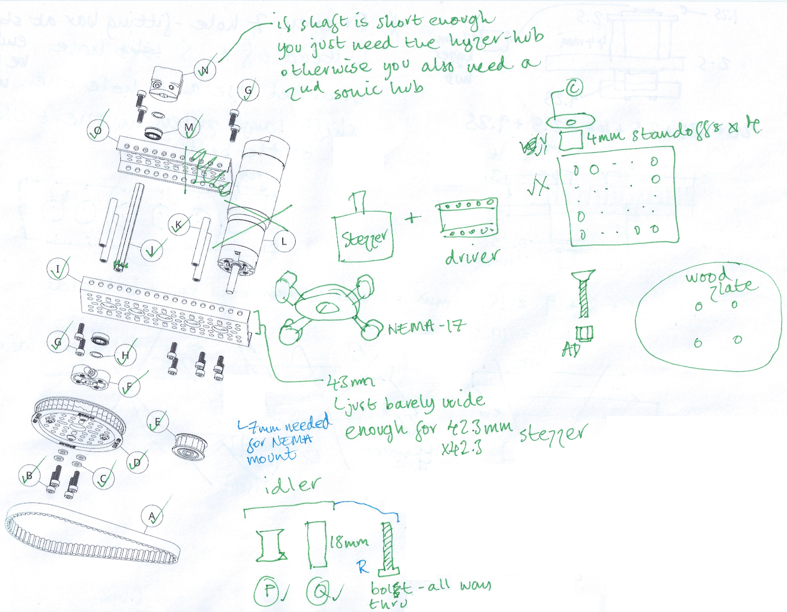
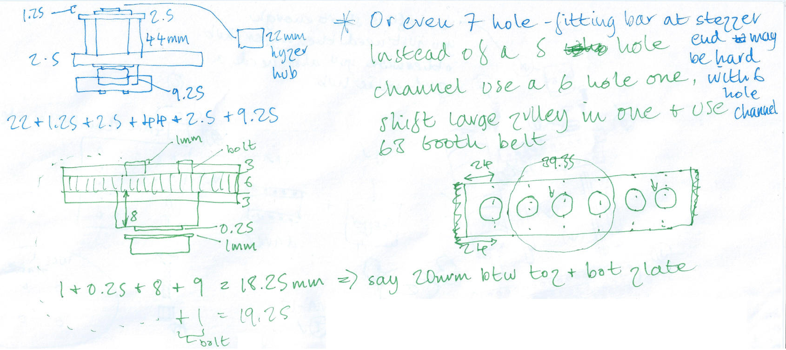
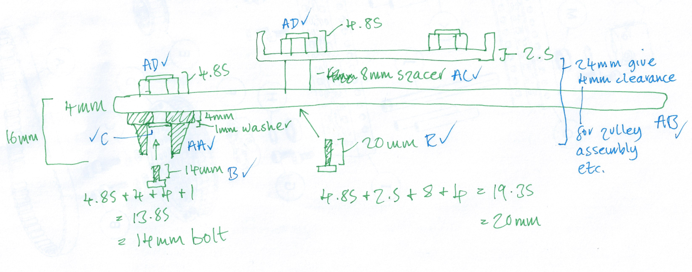

goBILDA turntable
=================

See [`assembly.md`](assembly.md) for a step-by-step walk-through of the build.

Parts
-----

### Pulleys and drive belt

| Qty | Item | SKU | Description |
|-----|------|-----|-------------|
| 1   | E | [3417-1006-0016](https://www.gobilda.com/3417-series-5mm-htd-pitch-set-screw-pinion-timing-belt-pulley-6mm-d-bore-16-tooth/) | 5mm 16 tooth shaft mount timing belt pulley |
| 1   | D | [3415-0014-0048](https://www.gobilda.com/3415-series-5mm-htd-pitch-hub-mount-timing-belt-pulley-14mm-bore-48-tooth/) | 5mm 48 tooth hub mount timing belt pulley |
| 1   | B | [2800-0004-0014](https://www.gobilda.com/2800-series-zinc-plated-steel-socket-head-screw-m4-x-0-7mm-14mm-length-25-pack/) | 14mm M4 bolt (25 pack).
| 1   | C | [2801-0004-0008](https://www.gobilda.com/2801-series-zinc-plated-steel-washer-4mm-id-x-8mm-od-25-pack/) | 8/4mm x 1mm washer (25 pack)
| 1* | A  | [3412-0009-0315](https://www.gobilda.com/3412-series-5mm-htd-pitch-timing-belt-9mm-width-315mm-pitch-length-63-tooth/) | 63 tooth belt

* A 72 tooth belt is needed, if you go for the goBILDA layout where the pulley centers are 96mm apart. However, I intend to move them one hole closer - this requires a 63 tooth belt. However, bringing them closer means even less of the small pulley's teeth are in contact - see the section below on idlers.

### Shaft

| Qty | Item | SKU | Description |
|-----|------|-----|-------------|
| 1 | F | [1309-0016-4008](https://www.gobilda.com/1309-series-sonic-hub-8mm-rex-bore/) | 8mm REX Sonic hub
| 1 | N | [1310-0016-4008](https://www.gobilda.com/1310-series-hyper-hub-8mm-rex-bore/) | 8mm REX Hyper hub
| 1 | J | [2102-0008-0090](https://www.gobilda.com/2102-series-stainless-steel-rex-shaft-8mm-diameter-90mm-length/) | 8mm x 90mm  REX shaft

With this setup, you have a Sonic hub holding on the large pulley at one end of the shaft and the Hyper hub at the other end to which the rotating plate can be attached. If you want to raise the plate much higher above the body, you could use a 220mm long shaft. See below for parts.

### Shaft support structure

| Qty | Item | SKU | Description |
|-----|------|-----|-------------|
| 1   | O    | [1121-0001-0048](https://www.gobilda.com/1121-series-low-side-u-channel-1-hole-48mm-length/) | 1-hole channel
| 1   | K    | [1501-0006-0440](https://www.gobilda.com/1501-series-m4-x-0-7mm-standoff-6mm-od-44mm-length-4-pack/) | 44mm standoffs
| 1   | M    | [1611-0514-4008](https://www.gobilda.com/1611-series-flanged-ball-bearing-8mm-rex-id-x-14mm-od-5mm-thickness-2-pack/) | 8mm REX shaft flanged ball bearing (2 pack)
| 1   | H    | [2807-0811-0250](https://www.gobilda.com/2807-series-stainless-steel-shim-8mm-id-x-11mm-od-0-25mm-thickness-12-pack/) | 8mm shim (12 pack).

Alternatives to the 1-hole channel would be a cheaper but less rigid [1-hole pattern plate](https://www.gobilda.com/1123-series-pattern-plate-1-x-1-hole-48-x-48mm/) or a [pillow block](https://www.gobilda.com/1603-series-face-thru-hole-pillow-block-8mm-bore/) (but it does not have a REX shaft bearing).

The 44mm standoff length is chosen to create an upper platform that roughly lines up with the top of the stepper motor. The motor is 38mm high, the NEMA mount is 8mm high = 46mm. The 44mm standoffs plus the 2.5mm thickness of the 1-hole channel = 46.5mm.

### Motor mount

| Qty | Item | SKU | Description |
|-----|------|-----|-------------|
| 1   | AI   | [1700-0016-0017](https://www.gobilda.com/1700-series-face-tapped-stepper-motor-mount-nema-17/) | NEMA 17 motor mount (M3 screws for bolting on motor are included)
| 1   | AE   | [2800-0004-0007](https://www.gobilda.com/2800-series-zinc-plated-steel-socket-head-screw-m4-x-0-7mm-7mm-length-25-pack/) | 7mm M4 bolts (25 pack)

The 7mm bolts go thru the 2.5mm channel and 5mm threads in mount. 7mm bolts are used, rather than 8mm ones, as the bolts mustn't extend beyond the other side of the mount.

**Update:** there's very little clearance possible between the small pulley and the heads of the M4 bolts used for the motor mount. An alternative would be the [low-profile 6mm bolts](https://www.gobilda.com/2804-series-zinc-plated-steel-low-profile-socket-head-screw-m4-x-0-7mm-6mm-length-25-pack/) (there are no 7mm variants of the low-profile bolts).

### Bottom channel

| Qty | Item | SKU | Description |
|-----|------|-----|-------------|
| 1   | I    | [1121-0007-0192](https://www.gobilda.com/1121-series-low-side-u-channel-7-hole-192mm-length/) | 7-hole low-side u-channel
| 1   | G    | [2800-0004-0010](https://www.gobilda.com/2800-series-zinc-plated-steel-socket-head-screw-m4-x-0-7mm-10mm-length-25-pack/) | 10mm M4 bolt (25 pack)

The original [5-hole low-side u-channel](https://www.gobilda.com/1121-series-low-side-u-channel-5-hole-144mm-length/) only works if you don't need stablizing legs. A slightly cheaper but less rigid alternative to the u-channel would be an equivalent size [pattern plate](https://www.gobilda.com/pattern-plates/).

### Stablizing legs

| Qty | Item | SKU | Description |
|-----|------|-----|-------------|
| 1   | AB   | [1102-0017-0136](https://www.gobilda.com/1102-series-flat-beam-17-hole-136mm-length-2-pack/) | 17-hole flat beam (2 pack)
| 1   | AL   | [1102-0005-0040](https://www.gobilda.com/1102-series-flat-beam-5-hole-40mm-length-2-pack/) | 5-hole flat beam (2 pack)
| 1   | AA   | [2919-0001-0001](https://www.gobilda.com/12mm-tall-rubber-foot-1-1-8-pack/) | Rubber feet (8 pack)
| 1   | AD   | [2812-0004-0007](https://www.gobilda.com/2812-series-zinc-plated-steel-nylon-insert-locknut-m4-x-0-7mm-7mm-hex-25-pack/) | M4 locknut (25 pack)
| 1   | AC   | [1502-0006-0080](https://www.gobilda.com/1502-series-4mm-id-spacer-6mm-od-8mm-length-4-pack/) | 8mm spacers (4 pack)
| 1   | AH   | [2800-0004-0020](https://www.gobilda.com/2800-series-zinc-plated-steel-socket-head-screw-m4-x-0-7mm-20mm-length-25-pack/) | 20mm M4 bolt (25 pack)
| 1   | AM   | [2800-0004-0012](https://www.gobilda.com/2800-series-zinc-plated-steel-socket-head-screw-m4-x-0-7mm-12mm-length-25-pack/) | 14mm M4 bolts (25 pack)
|     |      | | Washers (already covered by C)

**Update:** I originally used to 17-hole flat beams with four rubber feet but this resulted in the wobbly table issue sometimes experienced in restaurants (and often resolved by propping up one leg with beer mats). Now, I use a 5-hole beam with a single foot in the middle at the motor end and a 17-hole beam with two feet at the large pulley end.

My calculations say the bolts holding the feet to the beams should be 14mm but in practice this proves to be at least 2mm too long - so 12mm bolts should be used instead (this is more relevant when placing a foot in the middle of the 5-hole beam where the bolt otherwise comes in contact with the main body above the beam).

Optional
--------

### Plate mount

Depending on how you create the plate, you may be able to screw it down directly onto the Hyper hub. Alternatively, you can create a mount for the plate out a 1x1 pattern plate and then screw down the rotating plate to the holes at the corners of the pattern plate.

| Qty | Item | SKU | Description |
|-----|------|-----|-------------|
| 1   | AJ   | [1123-0048-0048](https://www.gobilda.com/1123-series-pattern-plate-1-x-1-hole-48-x-48mm/) | A 1x1 pattern plate
| 1   | AK   | [1502-0006-0040](https://www.gobilda.com/1502-series-4mm-id-spacer-6mm-od-4mm-length-4-pack/) | 4mm spacers
| | | | Washers (already covered by C)
| | | | Locknuts (already covered by AD)

This mount is then attached to the shaft using the Hyper hub (covered above in the shaft section). An alternative all-in-one (but far smaller) mount would be the [quad block pattern mount](https://www.gobilda.com/1201-series-quad-block-pattern-mount-43-2/).

### Idlers

At noted above, bringing the pulleys closer together means that fewer of the small pulley's teeth are in contact with the belt. This _could_ lead to slipping. An alternative would be to use a larger belt and introduce idlers, allowing you to use them to bring more of the belt in contact with the small pulley.

| Qty | Item | SKU | Description |
|-----|------|-----|-------------|
| 1 | A  | [3412-0009-0340](https://www.gobilda.com/3412-series-5mm-htd-pitch-timing-belt-9mm-width-340mm-pitch-length-68-tooth/) | 68 tooth belt
| 1   | AF | [3413-0001-0001](https://www.gobilda.com/acetal-timing-belt-idler-6mm-id-x-12mm-od-12mm-width-1-1-2-pack/) | 5mm timing belt idler (2 pack)
| 1   | AG | [1501-0006-0180](https://www.gobilda.com/1501-series-m4-x-0-7mm-standoff-6mm-od-18mm-length-4-pack/) | 18mm x 6mm M4 standoff (4 pack)
|     |      | | 10mm M4 bolts (already covered by G)

An interesting alternative tensioning solution is the [arc-slot tensioner bracket](https://www.gobilda.com/1524-series-arc-slot-tensioner-bracket/).

### Longer shaft

As noted above, you could go for a longer shaft if you wanted to raise the plate higher above the body. The longest available length is 220mm (shorter lengths can be found [here](https://www.gobilda.com/stainless-steel-rex-shafting/)). With a 90mm shaft the Hyper hub secures the top end of the shaft against the body - with a longer shaft an additional Sonic hub would be required to fill this role.

| Qty | Item | SKU | Description |
|-----|------|-----|-------------|
| 1 | F | [1309-0016-4008](https://www.gobilda.com/1309-series-sonic-hub-8mm-rex-bore/) | 8mm REX Sonic hub
| 1 | J | [2102-0008-0220](https://www.gobilda.com/2102-series-stainless-steel-rex-shaft-8mm-diameter-220mm-length/) | 8mm x 220mm REX shaft

Notes
-----

The 22mm and shorter standoffs have threads that go all the way through. Above 22mm, they just support a maximum screw depth of 8mm at each end. This combined with the 2.5mm thickness of the plates and channels, that they're typically attached to, mean that they're generally used with 10mm M4 screws. E.g. see the screws labelled _G_ [here](https://cdn11.bigcommerce.com/s-eem7ijc77k/images/stencil/original/products/2229/27423/3417-1006-0016-Product-Insight-3__72788.1606836211.png).
  
Choosing REX bore shafts means that some cheaper options are not available to you, e.g. the [classic clamping hub](https://www.gobilda.com/1301-series-clamping-hub-8mm-bore/) is only available for round bore shafts.

**Update:** when I made my purchase, the 18mm standoffs were out of stock, so I bought 19mm ones. Similarly, the 220mm shaft was out of stock, so I bought the 200mm one.

Plate
-----

Flat headed M4 screw (not available from goBILDA) and a laser cut wooden plate.

Pololu
------

* [#2267](https://www.pololu.com/product/2267) - 2.8V/1.7A 42x38mm 200 steps/rev bipolar stepper motor.
* [#2133](https://www.pololu.com/product/2133) - DRV8825 stepper motor driver board (high current).
* A 12V power supply.
* A 25V rated electrolytic capacitor with a capacitance of at least 47uF.
* grommets to damp vibration of motor.

Using the DRV8825 with the Pi: https://www.youtube.com/watch?v=LUbhPKBL_IU

47uF is a common capacitance, however, 100uF is slightly more common and just as suitable. The rule-of-thumb seems to be that you should choose a cap with a voltage rating that's twice as high as the voltage being used, e.g. for a 12V setup use a cap rated for 25V.

Examples of suitable capacitors include this [one](https://www.adafruit.com/product/2194) from Adafruit or this [one](https://www.sparkfun.com/products/96) from Sparkfun. I used these [ones](https://www.reichelt.com/de/en/e-cap-radial-100-uf-25-v-105-c-low-esr-fm-a-100u-25-p200027.html) from Reichelt. For advice on choosing capacitors, see [this page](https://www.ladyada.net/wiki/partfinder/caps) from Adafruit.

I bought these [grommets](https://www.tme.eu/ch/en/details/fix-or-4/seals/fix-fasten/) - whether they dampen anything is unclear.

Note: there's also a variant of the driver that can take an input voltage of 5V. However, everyone seems to use the 12V capable variant. Is there any reason for choosing one over the other beyond the voltages involved?

TODO: how much current does the motor draw, i.e. what's the minimum acceptable current rating for the 12V power supply?

Tensioners
----------

From the perspective of the wheels, is there any advantage to using two tensioners vs just one?

### Two tensioners

Here it shows two tensioners and mentions that they help to minimize skipping:  

### One tensioner

But can't you achieve the same amount of contact by just applying all the tension from one side?  

Pictures
--------

See [`images`](images) subdirectory for `.xcf` files that have already been somewhat adapted to reflect this design.

---

### Legs

Scans
-----

