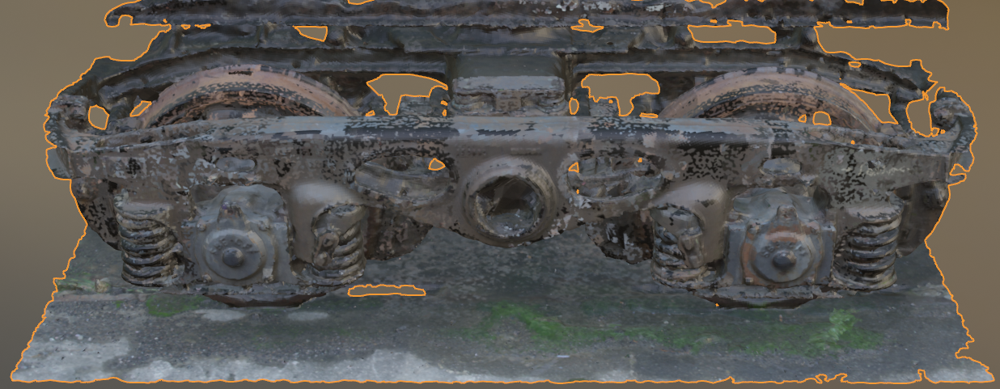
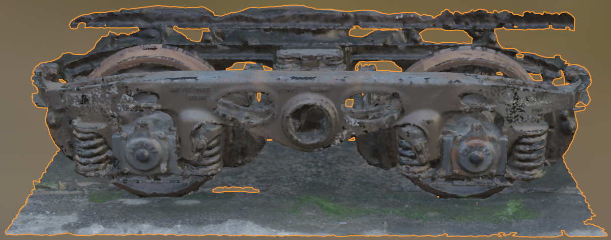
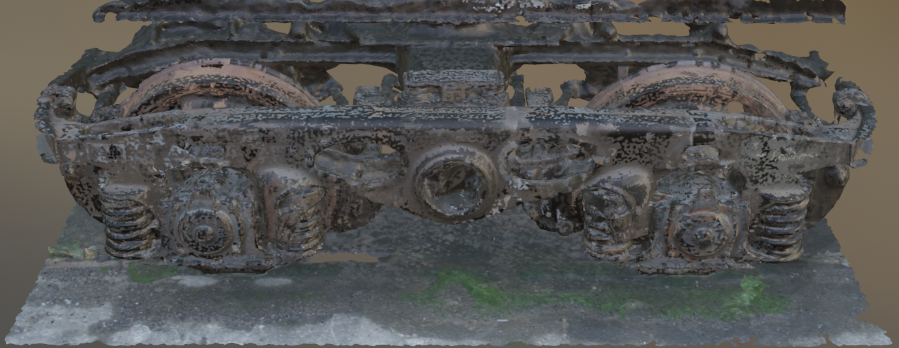
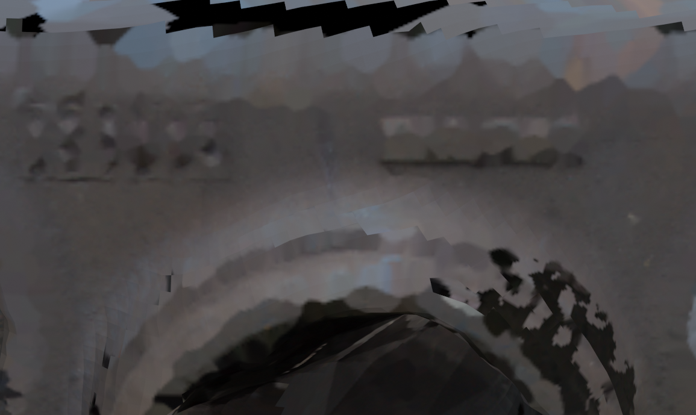
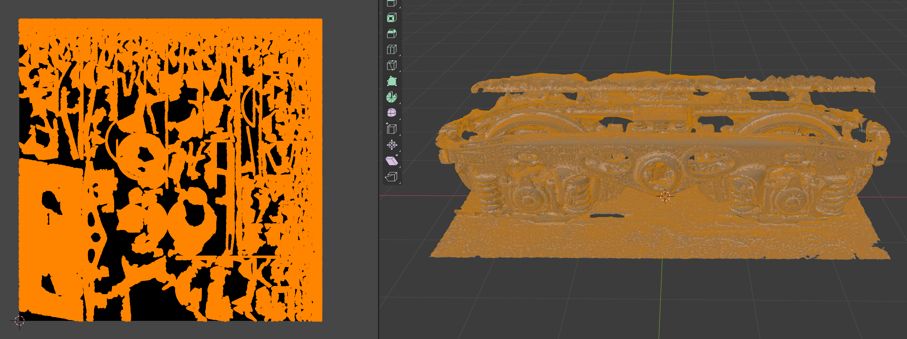
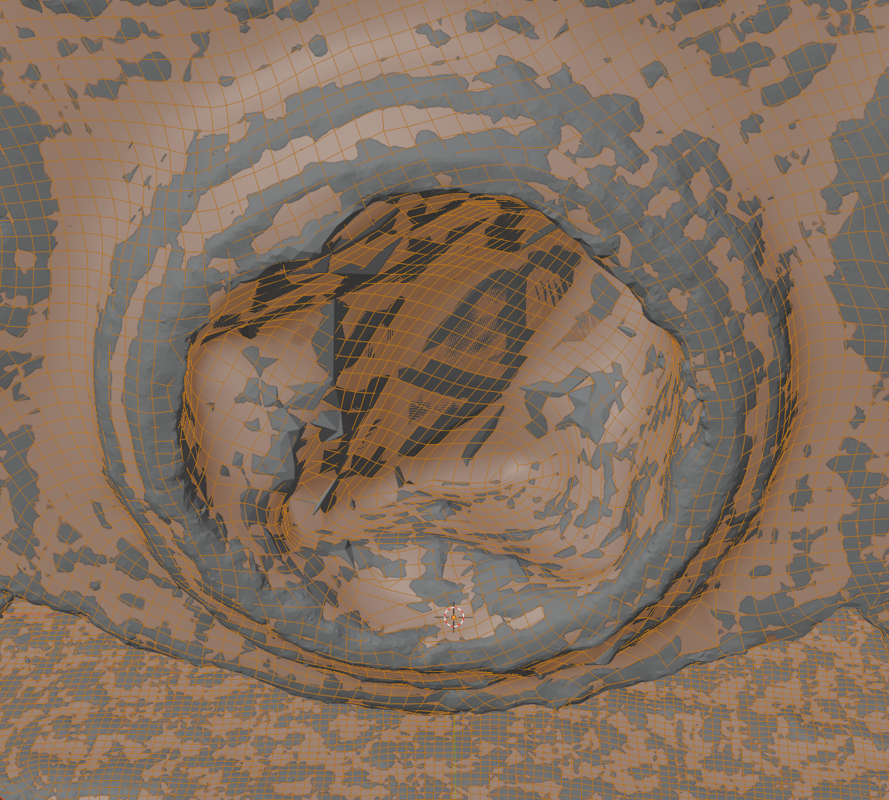
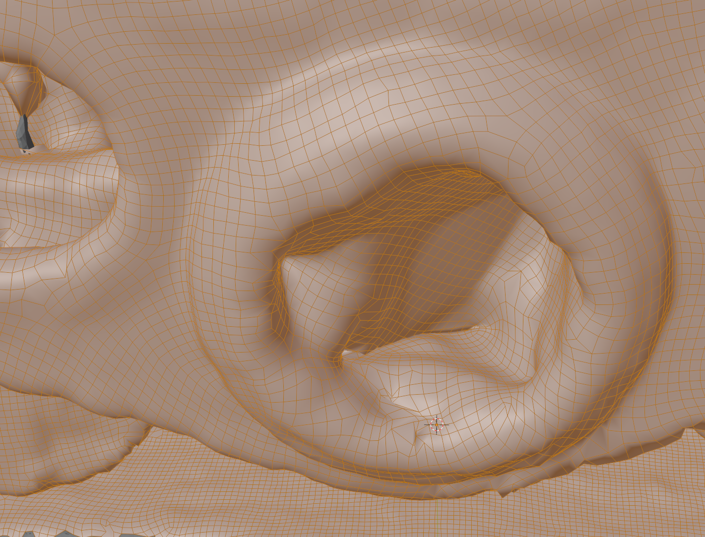
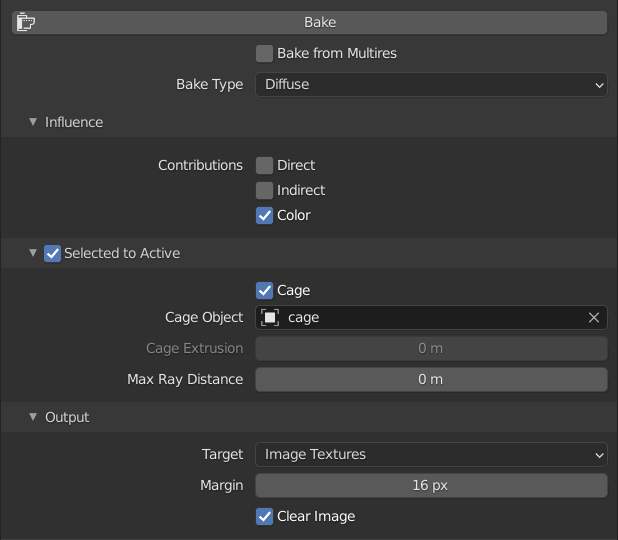

Meshroom batch mode
-------------------

Running Meshroom in batch mode:

    $ meshroom_bin=$HOME/Meshroom-2021.1.0-av2.4.0-centos7-cuda10.2
    $ PATH=$meshroom_bin:$PATH

    $ meshroom_batch --input *.NEF --save foo.mg

You can also add `--output bar` and the resulting `.obj`, `.mtl` and `.png` files are copied from the `MeshroomCache/Texturing` to the given directory. I don't feel that this copying (rather than moving) adds anything.

Aside: the `.../MeshroomCache/DepthMap/.../..._simMap.exr` files are quite cool to look at. The `.../StructureFromMotion/...` directory contains two HTML reports (with graphs) - `sfm_log.html` and `sfm_report.html` that look like they might be useful to understand.

Working with Meshroom results in Blender
----------------------------------------

Open a new Blender project, remove the default cube and import the `.obj` file that Meshroom created in its `MeshroomCache/Texturing/xyz` directory (where `xyz` is some [UUID](https://en.wikipedia.org/wiki/Universally_unique_identifier) like value encoded in hex).

Rotate and center it in the front, side and top views.

Set the object's origin to the 3D cursor.

Once done go to _Apply_ (under the _Object_ menu) and select _Rotation_ - otherwise, e.g. remesh will produce a mesh that reflects the original orientation.

In front, side and top views, select what you want, invert and then delete faces to trim away everything else.

Under _Viewport Overlays_ select _Statistics_ (so you can see how many faces etc. you're working with) and select _Face Orientation_ so that you can see the faces colored red and blue and can spot odd folded over elements.

The statistics also show how many vertices, edges and faces are currently selected - this is useful, e.g. below when selecting loose faces as you can see if anything has actually been selected (if it's not obvious visually).

Cleaning up the mesh
--------------------

Select a face of the main body and then select linked and again invert and delete vertices (to remove all free floating entities).

Switch to edge select and under select similar, select _Loose Geometry_ and delete egdes - this will remove weird little edges that are sticking out from the object. Switch to face select and again select _Loose Geometry_ and this time delete faces to do the same for faces.

---

**Update:** alternatively, just go to _Mesh / Clean Up / Delete Loose_.

_Delete Loose_ is the only one that won't require a rebake.

Select _Mesh / Clean Up / Degenerate Dissolve_ to get rid of completely redundant faces and edges (all other cleanups require some degree choice/compromise).

_Mesh / Clean Up / Merge by Distance_ oddly introduces additional holes.

_Limited Disolve_ (with its 5&deg; default) seriously reduces the number of faces.

_Decimate Geometry_ has no additional affect if you've already done _Limited Disolve_.

_Fill Holes_ with e.g. a value of 64 can be used to patch up holes. I wonder if it'd work better at the end - after simplifying the mesh and making things planar?

---

The _Mesh / Clean Up_ menu items allow you to dramatically reduce the number of faces. See this All3DP [page](https://all3dp.com/2/blender-simplify-mesh-simply-explained/) for a good breakdown of these options. And more - it also discusses using boolean modifier to define a space outside which everything should be removed.

TODO: see also edge collapsing and un-subdividing as covered in this separate All3DP [page](https://all3dp.com/2/blender-how-to-reduce-polygons/).

Peter France nicely describes how to use the knife tool to cut off bits of your model that you don't want - see the [2m 38s mark](https://www.youtube.com/watch?v=6VjA9EfkFSc&t=158s).

Manually cleaning up the mesh becomes much easier if you hide all but the bit of the mesh that you're currently working on. This allows you to e.g. select a face and then go to _Select Similar / Normal_ and select just the similarly oriented faces that are visible (rather than similarly oriented faces throughout the object). See my Blender Stack Exchange [question](https://blender.stackexchange.com/q/229960/124535) and the comment on it about hiding.

Reducing face count
-------------------

There are a number of approaches, you can take now to reduce the face count:

* Decimating
* Remeshing
* Using the _Mesh / Clean Up_ options.

Decimating is quick but produces fairly unsatisfactory results as far as detail is concerned. Remeshing can be complicated. After trying out various things, I'm inclined to clean-up the mesh with the _Mesh / Clean Up_ options, then remesh it and then _seriously_ clean up the resulting mesh by hand (using _Quad_ remeshing seems to result in a lot of odd meshing issues).

Using the _Mesh / Clean Up_ allows you to reduce the number of faces as dramatically as is typically done with decimate but with much better results visually.

### Decimating

To decimate, go to _Modifier Properties_, unselect _Realtime_, i.e. the monitor icon, otherwise you just recalculate everything twice, select a _Ratio_, e.g. 0.1, and select _Apply_.

Decimating has a dramatically worse effect on fine texture detail than I'd expect, e.g. look at its effect on the raised numbers on the bogie.

### Remeshing

Getting complex shapes into the manifold state needed by the Blender _Quad_ remesher is very time-consuming.

**Update:** actually it depends on the object - the carriage bogie that I scanned was essentially impossible to reduce to a manifold due to all its complex parts but the Roman bust that I scanned was trivial to get into a manifold state.

Note: if you use the _Quad_ remesher, then you need to duplicate the object before remeshing (so that you have the original and the remeshed objects for baking) and you have to give the duplicate its own material - just go to the duplicated object's _Material Properties_ and delete the materials it shares with the original before adding a new material.

Using [AutoRemesher](https://github.com/huxingyi/autoremesher) with _Density_ set to 1 and _Edge scaling_ set to 1 (the finest settings) _before_ you load a model results in a very good remesh without the manifold issues of _Quad_.

Remeshing with the finest AutoRemesher settings takes many minutes - with no indication in the UI that it hasn't simply hung, there is however output on the command line.

TODO: if you go into sculpt mode and press `shift-R` and select a size and then press `ctrl-R` you get very similar results to going to _Remesh_ in _Object Data Properties_ and doing a _Voxel Remesh_ - are the two the same thing?

Unfortunately, development of AutoRemesher seems to have stopped in September 2020 (a few commits after that date are simply related to updating sponsoring information).

The author of AutoRemesher, Jeremy Hu, mentions OpenVDB in this [blog post](https://blogs.dust3d.org/2020/06/19/auto-remesher/) saying that it's an "academy award winning library" and that its `VolumeToMesh` operation is great for high dense quads generation.

Blender actually uses this operation in its _Volume to Mesh_ modifier - however, as its name suggests it only works for volumes - so I wonder how Jeremy used it in to get from an `.obj` to the OpenVDB version shown in the main image at the start of his blog post?

Jeremy also mentions Quad Remesher - a closed source option that he says is "state of the art" - which seems to be reasonably priced ($60 for the Blender plugin - see [here](https://exoside.com/quadremesher/quadremesher-buy/)) and is also available as a 30 day free trial.

**Update:** in his video "The ULTIMATE Automatic Retopology Guide for Blender!", Russell Midfield goes over the same remeshers that Jeremy covers. He comes the conclusion that the paid Exoside Quad Remesher is definitely the best. At the [4m 41s mark](https://www.youtube.com/watch?v=CviZw41IbMg&t=281s) he describes a method get the remeshed version closer to the original hi-poly version (independent of the remesher being used) using a _Multiresolution_ modifier and a _Shrinkwrap_ modifier.

Baking
------

If you remesh, you end up with a low-poly object but you then have to bake the texture from the original object to the low-poly version.

To bake, you have to go to _Render Properties_, select _Cycles_ as the _Render Engine_ and then a _Bake_ section becomes available below.

Note: it's also possible to do the retexturing back in Meshroom as per the [well video](https://www.youtube.com/watch?v=Iy9KUAO3Oe0).

Cage vs ray distance baking
---------------------------

When baking from a high-poly mesh to a low-poly mesh, the two meshes don't overlap perfectly. The baking process needs to know by how much the two meshes may diverge, e.g. 2cm at most.

In Peter France's [video](https://www.youtube.com/watch?v=dKo0rWXVAlc), he uses ray distance to manage this. I tried this and found it resulted in a number of issues. These issues went away when I switched to using a cage to manage this instead, as described in Grant Abbitt's [video](https://www.youtube.com/watch?v=nJ0PM7m9TJc).

Here you can see the odd mottling, I got with a _Max Ray Distance_ of 0.1m:

Things got better if I reduced the value to 0.01m but reducing the value still more didn't improve things further. There are still clear glitches:

Oddly, a value of 0 doesn't seem to correspond to a low value like 0.01m, instead, it's actually worse than the 0.1m result up above:

Note: the glitches look kind of metallic above but this is just an artifact of the material having a _Specular_ value of 0. Below you can see these glitches are really pure black.

As well as the glitches, the resulting texture map is of much lower details, than if using the cage method, even though the texture image is the same size.

Notice that the text is unreadable and see the patches of flat color (rather than detail) in particular just below the black glitch at top-center. Compare this with the texture produced by the cage method:

Bake
----

The following section describes baking using the cage method.

_Original hi-poly (viewed with Material Preview)_  

Select the hi-poly object and export using _File / Export / Wavefront (.obj)_ and in the export dialog tick the _Limit to Selection Only_ option.

Remesh the exported object (covered elsewhere) and reimport it using _File / Import_. The visual result is a strange overlap of the original object and the remeshed one (the white parts). At different points the mesh of one or other extends out slightly further and hides the other.

It's these differences in the meshes that result in the need for a cage object later. But first...

Rename your objects to "hi-poly" (the original) and "low-poly" (the remeshed object) so it's easier to keep track of which is which. Select the low-poly object, right-click and select _Shade Smooth_.

Go to the _Shading_ workspace, select the low-poly object and in the _Shader_ editor add an _Image Texture_ node (and connect it to _Base Color_). In the _Image Texture_ node, click _New_ and choose a name, e.g. "bogie", and a width and height of 4096px. You can untick the _Alpha_ option as we don't need an alpha channel, but it's not important (at most it saves some image space).

Note: objects imported from Meshroom have a _Principled BSDF_ node that has almost all settings identical to the defaults - all except _Specular_ (which is set to 0 rather than 0.5) and _Roughness_ (which is set to 1 rather than 0.5). In one of Blender Guru's videos he notes that you should never really adjust _Specular_ down to 0.

TODO: find Blender Guru video and his related explanation.

**Important:** If you don't also adjust the _Specular_ of your low-poly object down to zero then later, its texture will appear much paler relative to the original object (once _Specular_ is 0, the value of _Roughness_ makes no difference). However, adjust the _Specular_ at this stage turns the low-poly object into a pure black space that's a bit confusing due to its lack of features.

Then switch to the _UV Editing_ workspace and select the "bogie" image in the _UV Editor_ and make sure you're in _Edit Mode_ in the _3D Viewport_ and that the entire mesh for the low-poly object is select. Press _u_ and select _Smart UV Project_ (and press _OK_ leaving all options as they are).

Switch to the _Layout_ workspace, select the low-poly object, press `shift-D` to duplicate it, press `ESC` (to avoid moving it) and rename the duplicate to "cage".

Note: the cage shares its material with the low-poly model - this can become a little confusing later if you're not expecting the cage to also change texture when the baking completes. You can resolve this by going to the _Shading_ workspace, selecting the cage object and clicking the _New Material_ icon in the _Shader Editor_. This duplicates the existing node setup, 

Hide the low-poly object, leaving just the cage and the high-poly object, select the cage, toggle to _Edit Mode_, press `alt-S` (_Mesh / Transform / Shrink/Fatten_) and move your mouse up and down.

Note: it's easiest to do this viewport shading set to _Solid_ and if you zoom in on a piece of the mesh.

_Initial situation_.  

You want to fatten the cage object such that it covers the high-poly object at all points of the mesh. If you hold down _shift_ while moving the mouse up and down, you get more fine-grained control.

_Fattened cage._

There were some areas, e.g. see the grey area in the upper-left of the image above, where the discrepency between the two meshes was so high that the cage would have to be ridiculously fattened to cover them. So I just left them exposed but for perfection these areas of the low and high poly meshes should really be cleaned up.

TODO: is there any cost to making the cage super fat? If there wasn't then why worry about cage size?

Zoom out and confirm that you're happy with the result, just press `alt-S` again and adjust if you're not.

TODO: what causes the two objects to have different colors (different shades of grey) when viewport shading is _Solid_?

Go to _Render Properties_ and select _Cycles_ as the _Render Engine_.

Expand the _Bake_ section, select _Diffuse_ as the _Bake Type_ and unselect the _Direct_ and _Indirect_ contributions. Tick _Selected to Active_ and expand its section, tick _Cage_ and select the cage object in the _Cage Object_ dropdown list.

Note: make sure _Max Ray Distance_ is 0 (_Cage Extrusion is greyed out but oddly still editable - leave it alone too).

Make sure none of the objects involved are hidden or things get confusing. In _Object Mode_, click the high-poly object and then control-click the low-poly object (i.e. both become selected with the last selected one becoming active) and click _Bake_.

Note: I made frequent mistakes that resulted in baking seeming to have no effect - this was generally a result of selecting the wrong objects at some point, e.g. fattening the low-poly object rather than the cage or baking from the high-poly to the cage object.

Once baking is done, hide the cage, select the low-poly object, press  `g` and `x` and pull it out to the left.

Note: if you didn't adjust _Specular_ earlier, you should do so now or the colors of the low-poly object will be paler than those of the original.

TODO: if you move the objects relative to each other with _Material Preview_ enabled or pan about, the colors of the two change noticeably relative to each other. I'm not sure why this is - I thought it was only the renderer that really adjusted colors based on viewing angle and object location.

**Important:** Blender will ask you if you want to save images such as textures when you exit, however, it will not automatically save them before this point even if you save the `.blend` file itself. This has odd consequences, e.g. if you save, make further changes and then _Revert_ - reverting can result in you losing your textures even though you're not reverting to a point before they were baked (or updated in whatever way) - reverting throws away all unsaved changes including the baked textures.

The best thing is to temporarily flip the _UV Editing_ workspace, select the relevant texture in the _UV Editor_ and then under the _Image_ menu select _Pack_ to include the image in your `.blend` file (or you can save the file externally, with _Save As_). If you make later changes to an image always remember to save it.

Update: cage object is optional
-------------------------------

Instead of creating a cage object, you can just select _Cage_ and set _Cage Extrusion_ to some value, e.g. 2cm, corresponding to how much fatter you would have made a corresponding cage object.

This seems to produce results that are just as good - the only reasons, I can see, for using a cage object is that you can more easily see how much fatter it needs to be to engulf the high-poly object. Having a cage object also gives you control of its mesh shape, allowing you to pull out specific areas to cover over oddly projecting areas of the high-poly object without having to make the overall mesh fatter.
