Door
====

The door has a less convenient shape than the previous objects:

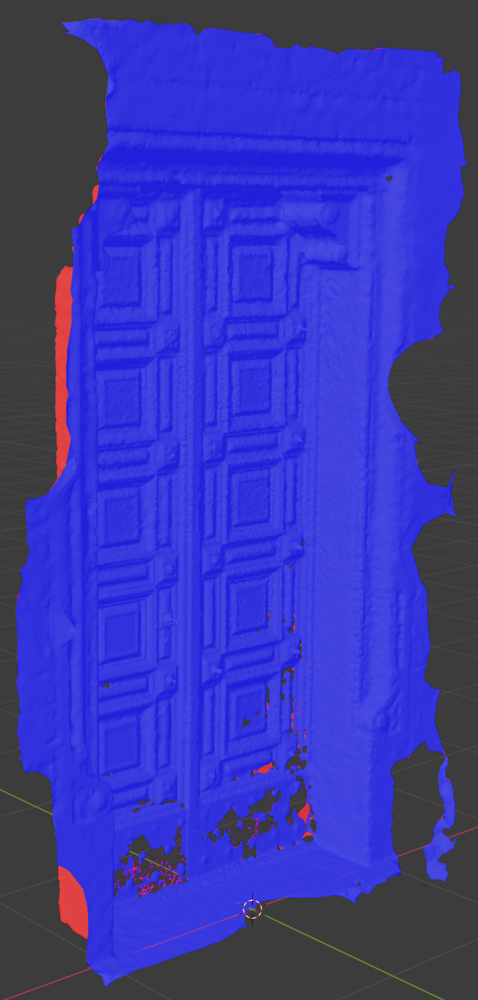

Red means inside and blue outside - however, as we learned with previous objects, solving non-manifold issues is much easier with objects that have no edge between inside and outside. I.e. a complete cube is much easier to work with than one that has a face missing such that you can see into the inside of the cube.

With the door there's a lot of red, i.e. inside, showing and no obvious way to easily close it off.

The door also has other issues that seem to be typically if the photos, that Meshroom had to work with, weren't perfectly lit.

### Folded-over geometry

First, folded-over geometry:

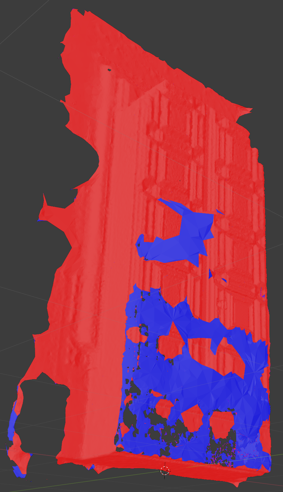

These blue faces on the back of the door aren't really part of the door, they're an extra layer of faces that are facing the wrong direction that ideally we could just peal off like some sheet of cellophane that's shot through with holes.

However, pealing them off isn't that simple - ideally you'd select one of the problem faces and then, using one of the _Select Similar_ options, select the rest and just delete them. But unfortunately, the similar set invariably contains faces you don't want to delete and you end up having to constrain _Select Similar_ by selecting subareas, inverting the selection, hiding the inverted selection and then applying a _Select Similar_ option within the remaining area. This all becomes rather time-consuming. See also this Blender SE [question](https://blender.stackexchange.com/q/229960/124535) and the comment below it.

Instead, we'll get rid of this geometry as a nice side-effect of solving our issue of the edge between the inside and the outside.

TODO: or will we - I have a bad feeling that these faces, as they're connected to the outside by holes, won't be seen as inside geometry.

### Starburst holes

Second, starburst holes:

The door is shot through with little holes that connect the faces on the front side of the door to the folded over geometry on the back.

If you try pealing off the folded over geometry with _Select Similar / Normal_ then you tend to get left with a whole load of particularly odd faces around the edges of these holes that you'd also like to have deleted but which can't be covered by any _Threshold_ value that doesn't end up including the entire mesh:

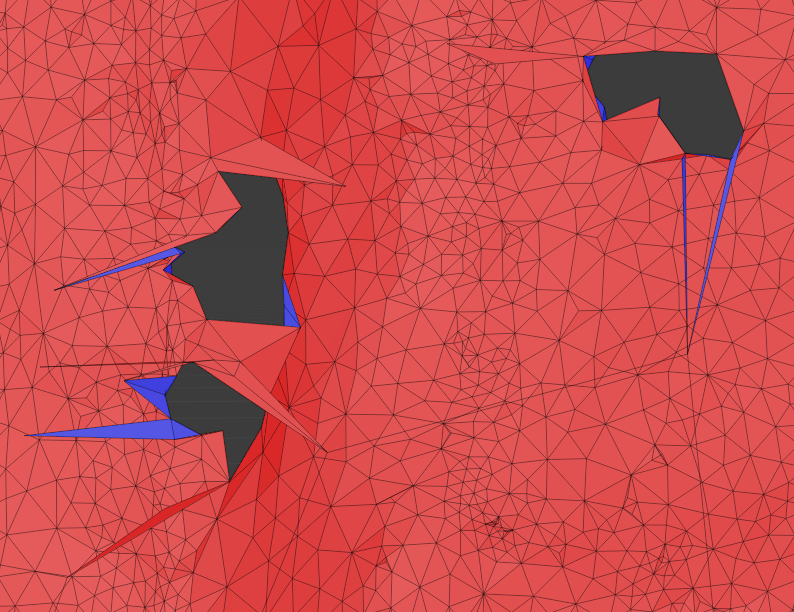

For want of a better word, I call such holes, with these left-over faces, starburst holes. Maybe meteor-strike holes would be a better word - the look like the edges you might get if a micro-meteorite struck the outer metal coating of part of your space station!

Lining up the front of the door
-------------------------------

First, let's get the front of our door very precisely lined up with the help of a triangle.

Select the door and `tab` into _Edit Mode_, in vertex selection mode, shift select any three suitable points in the door mesh that should clearly be part of the flat plane that we want the front of the door to be aligned with.

Duplicate and release them with `shift-D` and `esc`, then invert the selection and hide everything else with `h`.

Select _Mesh / Convex Hull_ to create a triangle from these three points, then select _Mesh / Separate Selection_ and use `F2` to rename this new mesh to "triangle".

Unhide everything, with `alt-H`, and, in the _Outliner_, select the main mesh, then ctrl-click the triangle and (in the _3D Viewport_), press `ctrl-P` and select _Object (Keep Transform)_. This will make the triangle the parent of the main mesh, such that, when we line up the triangle, the main mesh will move with it.

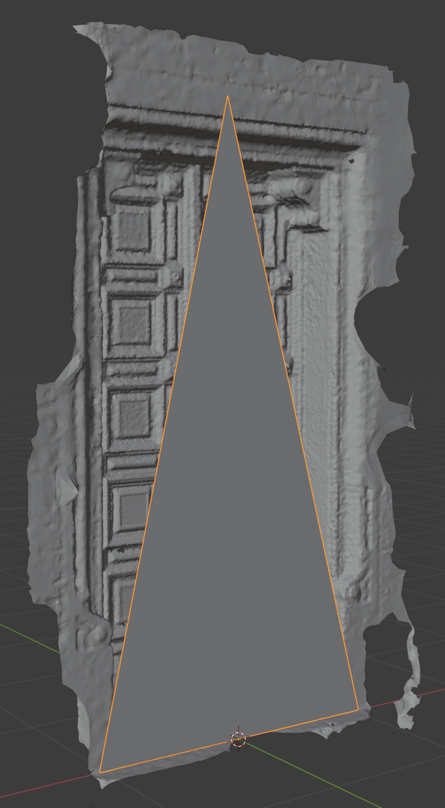

Hide the main mesh.

Grab the lower-left vertex of the triangle and move it onto the x-axis, then move the 3D cursor (`shift-RMB` to move it, `shift-C` to return it to the origin) so it's at the same point as this vertex and then set _Origin to 3D Cursor_. This will set the point of rotation for the triangle and make it easier to rotate the other two points such than all three points are flat against the x-z plane.

Finally, select the main mesh in the _Outliner_, then in the _3D Viewport_ go to _Object / Parent / Clear Parent_ and hide or delete the triangle object - the main mesh is now unparented from the triangle and all lined up.

Trimming what we don't want
---------------------------

For a smaller mesh, the easiest way to trim off unwanted geometry might be with the bisect tool. However, with the huge number of vertices and faces here, it is extremely laggy and inconvenient to use.

An easier approach is to add a cube and then resize it until it encloses everything we want to keep.

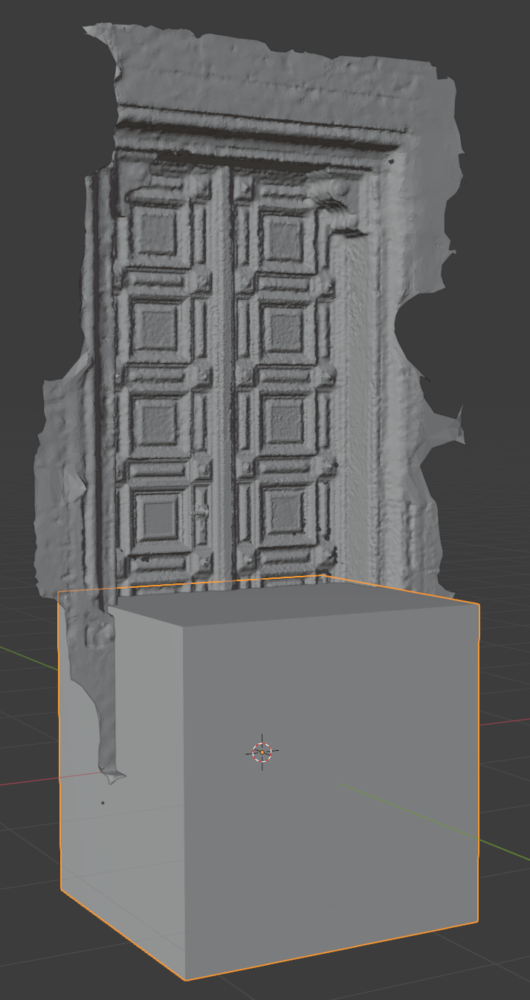

With the cube selected, `tab` into _Edit Mode_, switch to face selection and e.g. select just the top face and with `g` and then `z` drag the face upwards. Do similar things with the other faces until the cube covers all that we want to keep.

We can pull the front out as far as we want and pull the top and sides according to what will look nice:

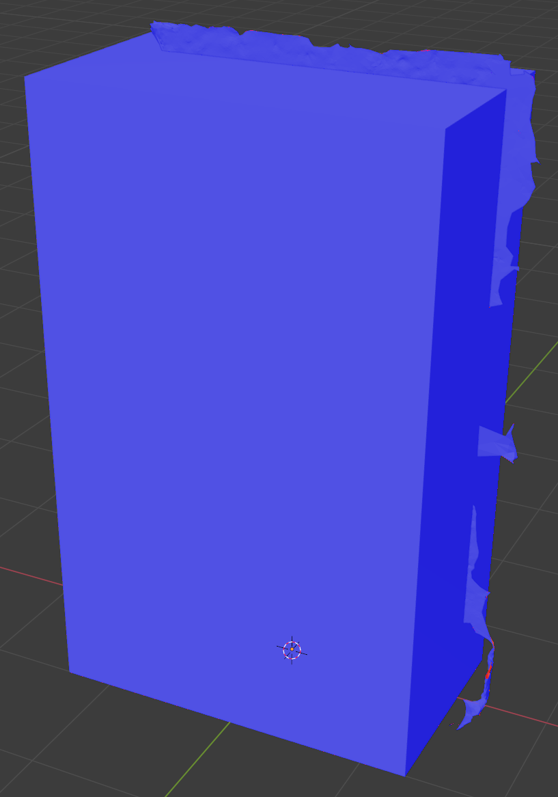

But with the bottom and particularly the back, try to move the faces of the cube very precisely such that they just barely cover the real faces of the door while leaving as much folded over geometry poking through:

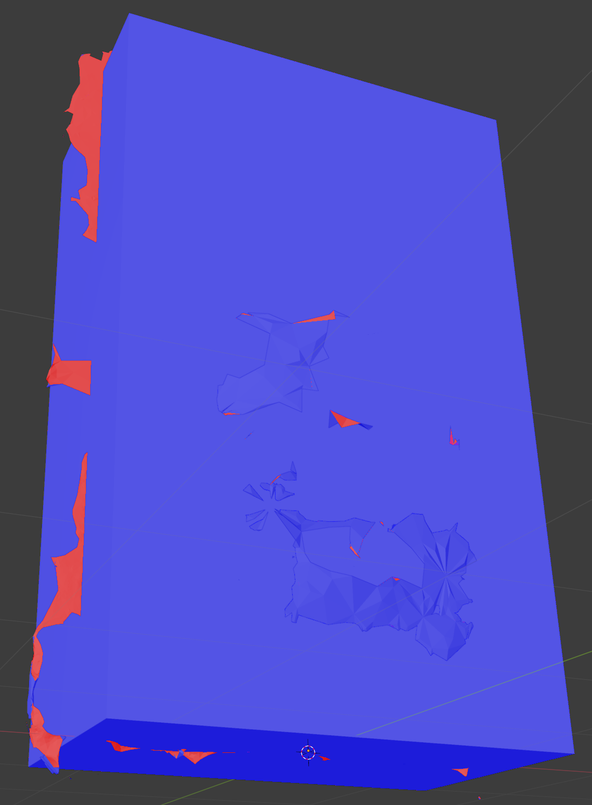

On the back we see folded over geometry - i.e. faces that are blue when the back of the door should be all red - and we see faces attached to these faces that have folded over further still to become red again.

On the bottom, we don't see folded over geometry but we do see the edge of the mesh drooping down through our cube - this is where Meshroom has miscalculated the angles of these edge faces (which should really be flat) so let's trim those away too.

Now, `tab` to _Object Mode_, select the main mesh and add a _Boolean_ modifier, toggle off _Realtime_ (the monitor icon), select _Intersect_, select the cube as the _Object_ value and `ctrl-A` to _Apply_.

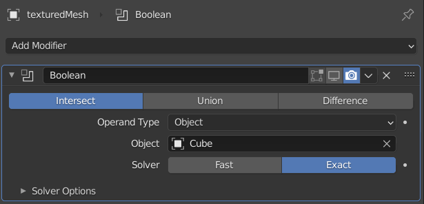

Hide the cube (don't delete it - it's going to be used further) and you get:

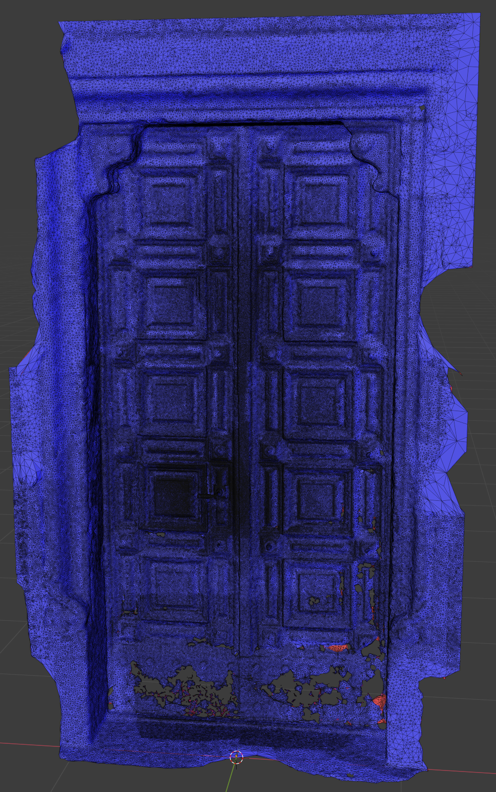

Pan around the edges of the object and manually trim off any remaining undesired areas, e.g. those odd sharp points just above the middle-right of the door. Selecting faces and then using `DEL` and _Only Faces_ gives the easiest result (in leaves odd edges in space but we'll clean them up later) - don't go mad, just knock out a few horrible faces (in particular faces along the edge that are red when all their neighbors are blue) and leave it at that, it's easy to get stuck fine-tuning the edge.

Now, in _Edit Mode_, select all with `a` and go to _Mesh / Clean Up / Delete Loose_.

Note: _Delete Loose_ is the only _Clean Up_ option that won't change the shape of the faces in the mesh - all all the other options will affect the shape (or whether vertices are shared or duplicated) and hence destroy the mapping between our texture and the UV unwrapped mesh.

Finally, select a face on the door and `ctrl-L` to select linked, invert the selection and delete the selection with `DEL` and _Vertices_.

For the door we lose the door handle as it was actually just floating in space, Meshroom had failed to reconstruct the connection between handle and door. This is sad but leaving it there results in odd results when we rebake onto our low-poly objects later (which really need to be just a single continuous mesh). The alternative to losing the handle would be to reconstruct the necessary geometry, that joins it to the door, by hand.

Constructing a frame
--------------------

Now, we're going to try and close off the inside of our mesh, i.e. the back on the door.

Unhide the cube we used earlier and pull out all the faces a bit such that the door is buried deeper inside, i.e. there's space all around the door between it and the cube.

Use _Loop Cut_ to cut some extra edges into our cube. Personally, I find it easier, rather than switching to the _Loop Cut_ tool, to add each loop cut one at a time with `ctrl-R`, move to an edge to get the cut orientation I want, `LMB` and release to place, then move the mouse to place and `LMB` to complete (or `RMB` to accept the default). With scroll-wheel, before the initial `LMB`, to add more cuts if wanted. When you instead switch to the _Loop Cut_ tool the behavior is somewhat different (see 1m 31s mark in this [video](https://www.youtube.com/watch?v=-pCf3DjsEBg&t=91s) for more).

We want two loop cuts that will allow us to cut out a quarter of the cube:

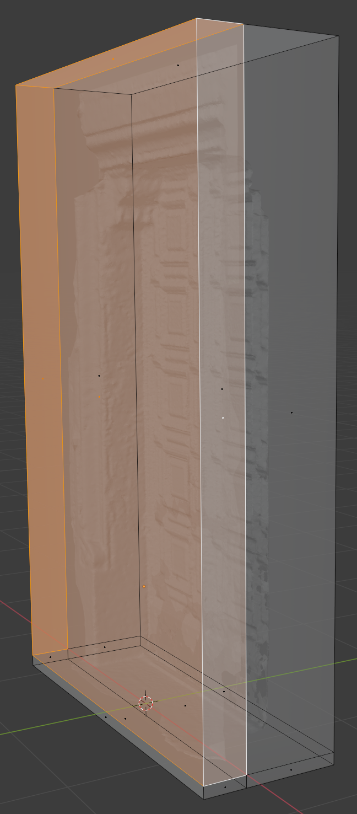

`DEL` and _Faces_, add new faces in the opened up spaces (select the relevant vertices and press `f`) and delete the unneeded edges around the bottom right "cube" (with _Dissolve Edges_ otherwise you get leftover vertices).

Note: `f` will add a face if enough vertices are selected or an edge if only two are selected.

The end result, notice in particular the angled egde bottom right that replaces the original set of perpendicular edges in the original.

Note: I originally just created these edges with `f` but this doesn't create additional faces - instead the _Knife_ tool is the thing to use to introduce these edges along with faces either side.

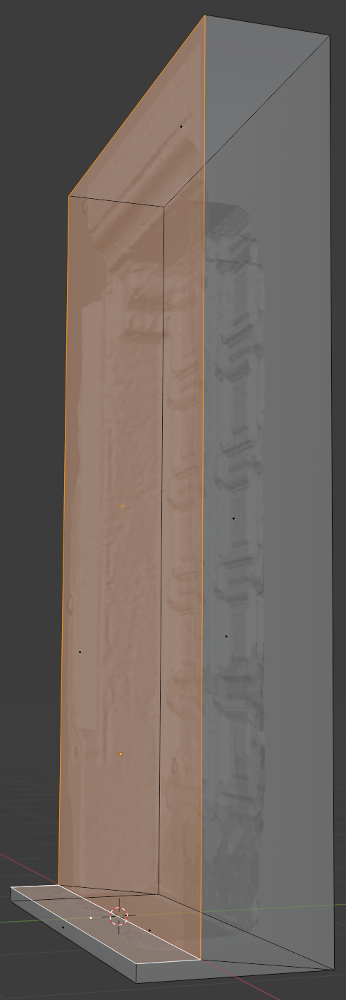

If everything went correctly the edge shown here should line up with the junction between floor and wall of the main mesh:

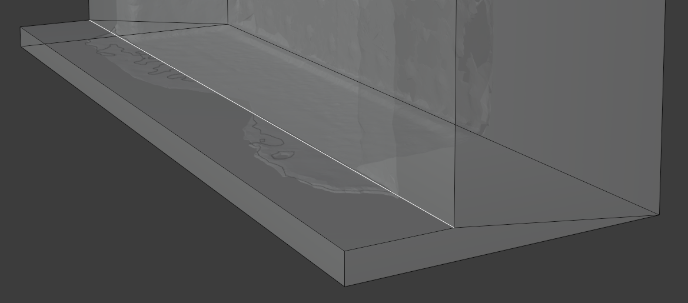

But now grab the two faces either side of this edge and move the a little up and forward of this point:

Select the five faces of the upper "cube", select _Mesh / Separate / Selection_ and rename the result to "frame-top", hide the object from which it was split and patch the bottom of "frame-top" with a face to make it complete.

TODO: it's not clear if I had to rip the bottom four vertices with _Vertex / Rip Vertices_ - I did this but then moved on too far before wondering if I could have done without that step.

Now, hide "frame-top" and select the remainder of the object from which it was separated:

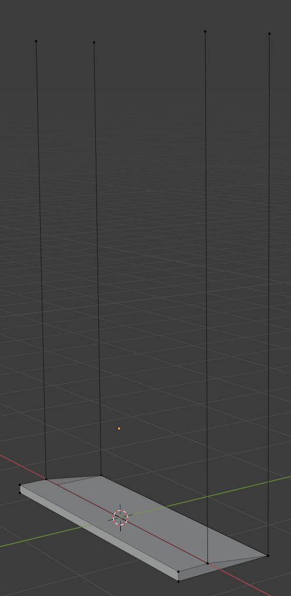

TODO: when separating, is there anything I could have done to avoid leaving the four upper vertices that now need be deleted?

Delete the four upper vertices left floating in space and again patch on a face as the point where "frame-top" was separated. Rename the resulting object "frame-bottom".

Now, we've got two separate objects, "frame-top" and "frame-bottom":

Cutting out the frame
---------------------

Now, hide everything except "frame-top" and the main mesh. Duplicate the main mesh, rename this "back-outline" and hide the main mesh.

Select the four vertices that make up the back wall of "frame-top" and `shift-D` to duplicate them and then _Mesh / Separate / Selection_. Hide "frame-top" leaving this separate back wall.

First attempt: select "back-outline", then, in _Edit Mode_, press `DEL` and _Faces Only. Then press `NumPad-1` and confirm you're in _Front Orthographic_ view, toggle back into _Object Mode_ and first select "back-outline" and shift select the back wall. Then toggle back into _Edit Mode_, don't select anything (it's the selections made during _Object Mode_ that count) and select _Mesh / Knife Project_ - then wait more time than you've got. This actually would be a cool approach for a mesh with fewer vertices - see this Blender SE [answer](https://blender.stackexchange.com/a/101555/124535) for more.

Second and more successful attempt: wind back and don't duplicate the back wall of "frame-top", just duplicate the main-mesh and this time call it just "outline", select it, `tab` to _Edit Mode_, make sure you're in vertex selection mode and select _Mesh / Select All by Trait / Non Manifold_. Then invert and `DEL` wiht _Vertices_. Select all with `a`, then `3` (for face select) and again `DEL` but this time _Faces Only_. Now, `2` (for edge select) and select an edge in the outline, invert the selection and `DEL` with _Vertices_.

Now, we have the outline of the door:

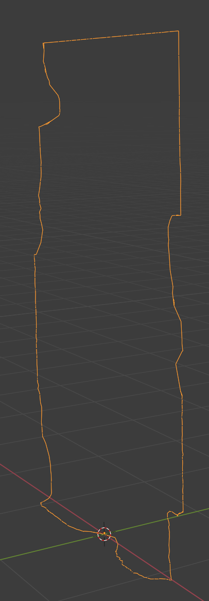

If you look closely, there are a few odd little triangles without faces but this is OK.

Now, duplicate this outline twice and call one copy "back-outline" and one "bottom-outline". Hide everything except "back-outline", select it, `tab` into _Edit Mode_, `NumPad-3` for side view, `a` to select all then press `s`, `y`, `0` and `Enter` so scale it flat.

Then, with the outline still selected, `alt-F` to fill the space with faces, then _Mesh / Clean Up / Limited Dissolve_ and _Mesh / Clean Up / Degenerate Dissolve_.

If you've statistics on you'll see there's still more than one big face but the other faces are just chaff, press `3` (face selection), select the main face, press `1` (vertex select), invert the selection and `DEL` with _Vertices_.

Now, we've got the back outline. `NumPad-3` again, `a`, `e` (for extrude) and extrude it a little bit backwards so you end up with:

Now, hide the result and we'll do something similar for the "bottom-outline". But this time we're going to delete all but the bottom part before we set about flattening it:

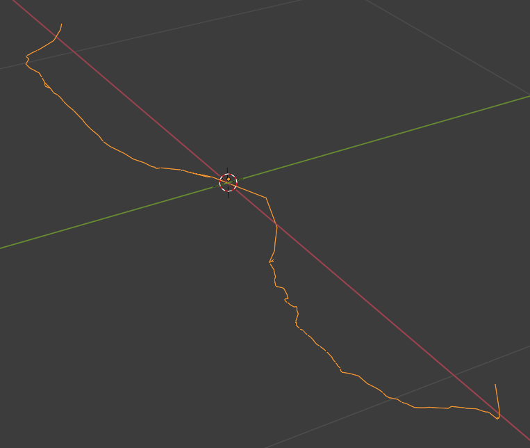

I've left the bottom couple of centimeters of the sides but its not that important. Then flatten everything as before, except use `z` instead of `y` when scaling.

Looking from above (with `NumPad-7`), a little cleanup is required at the left and right extremes - if the line folds back in after reaching the widest point just snip off the few folded in vertices. Then one at a time, extrude the two outer-most vertices backwards, connect them with `f` and do the same _Clean Up_ steps as before creating a single face:

Then extrude as with the "back-outline":

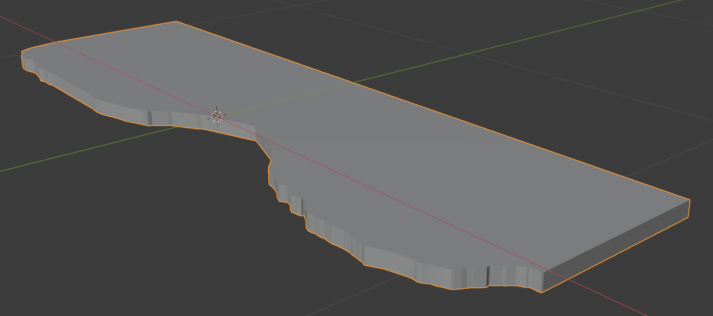

### Booleans

Now, we're ready to cut these outlines from the frame elements we created earlier.

Unhide the frame bottom and top and the outline bottom and back. Push the back outline forward and the bottom one up a little if necessary such that both just poke out above the surface of the frame elements:

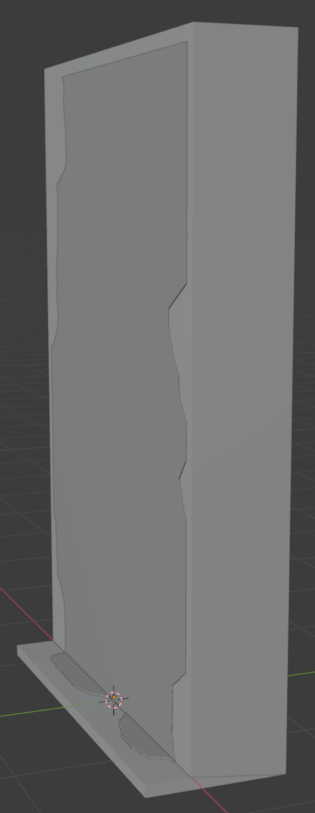

Then add a modifier to each frame part to subtract its corresponding outline:

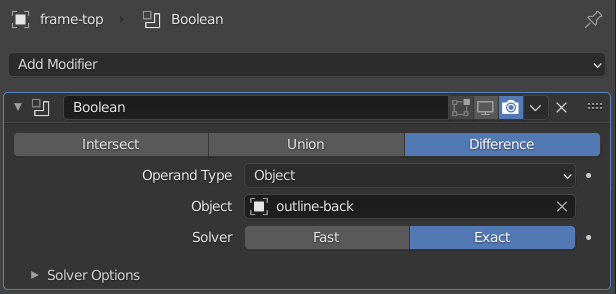

Apply the modifers and once the outlines are hidden the result is clear:

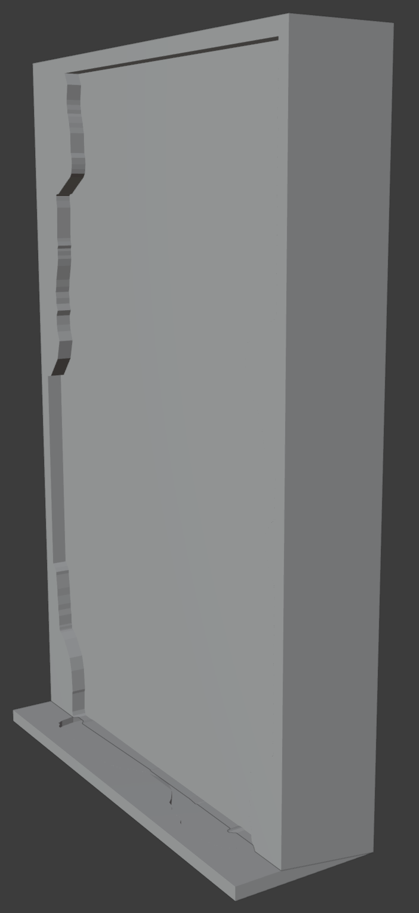

Now, knock out back and bottom faces formed by the outline and the faces where the two frames join.

This is a little more involved for the top frame as we have to knock out some faces formed by the bottom of the outline:

Now use a _Boolean_ modifier with union to join the two frame halves back into a single piece.

Note: if you get very odd results from a _Boolean_ modifier, you have to switch from _Exact_ to _Fast_ due to issues with manifold surfaces.

Idiocy warning: always remeber to hide the other object after applying a boolean modifier - after joining the frame halves, I wondered why the bottom had darker colors than the top:

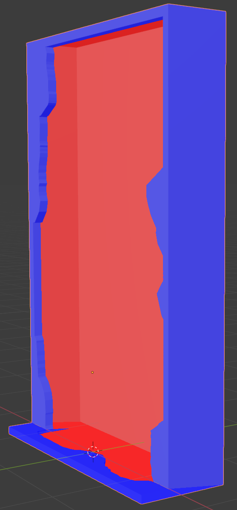

Trying to interact with this resulted in all kinds of strangeness - but it was simply that I'd forgotten to hide the bottom after using it in the union with the top - so I had the mesh of the unioned top and the bottom mesh in the same place.

To merge the outer faces where the two parts join, you have to first do `a` and _Mesh / Clean Up / Merge By Distance_ to merge the common vertices, then _Mesh / Clean Up / Limited Dissolve_.

Then a little further manual clean up at the inner points where the two outlines joined:

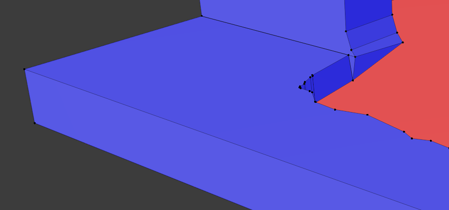

The big faces with the outlines cut out of them are impossible to work with later. So as final step, `a` and _Mesh / Clean Up / Split Concave Faces_. This produces a lot of smaller faces but when it comes to shrinking and the like, Blender can work with these much more easily.

### Mesh and frame

First, let's fatten the frame a tiny bit to create more overlap. Select the frame, right-click on it and select _Set Origin / Origin to Center of Mass (Volume)_ so that shrinking happens relative to a more central point.

Select the frame, `tab` to _Edit Mode_, `a` and select _Mesh / Transform / Shrink/Fatten_ and enter `0.01` and `Enter` to fatten by 1cm.

Now, we're ready to unhide the main mesh:

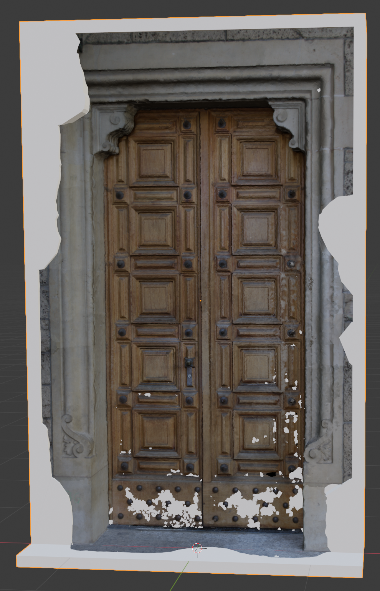

The overlap isn't perfect.

Now, use a _Boolean_ modifier to union the main mesh with the frame.

It turns out that it's impossible to merge the two meshes - I even created a low-poly version of the mesh and tried again. It just didn't work.

The thing that did work was to go back and make the frame a manifold, i.e. no insides visible from the outside:

So we could have started working on a lower-poly version of the main mesh earlier and used it for creating the frame.

Will recalculating normals after boolean union make anydifference.

Filling the holes is maybe the most important thing - maybe the frame is a waste of time.

When I unioned the frame with the low-poly main mesh it did end up with weird normals under Obj Data / Geom data.

Solidifying the frame produced much better results than my BS attempt at giving it solidity.

Intersecting was interesting - https://blender.stackexchange.com/a/162133/124535

After doing a bisect and fill, I had to do a _Merge by Distance_ otherwise the vertices along the cut are still non-manifold.

Old notes
---------

Select non-manifold, invert, DEL vertices

`1`, `a`, `3`, DEL only-faces

NumPad-3, `a`, `s`, `y`, `0`, RET.

`alt-F`, _Limited Dissolve_, _Degenerate Dissolve_.

`3`, select the main face, anything else is general weird rubbish, then `1`, invert, DEL vertices.

NumPad-3, `a`, `e`, drag.

---

---

TODO:

Take pictures of cube - we get rid of some weird geometry on underside and back but the "frame" is the real thing for that (boolean will elminate all that as _internal_ geometry).

Once boolean is applied - `ctrl-L`, invert and DEL vertices (we lose the handle as well as lots of junk).

Then build frame - see how to build 2D outline in Blender SE answer on Mac (or see my approach above).
